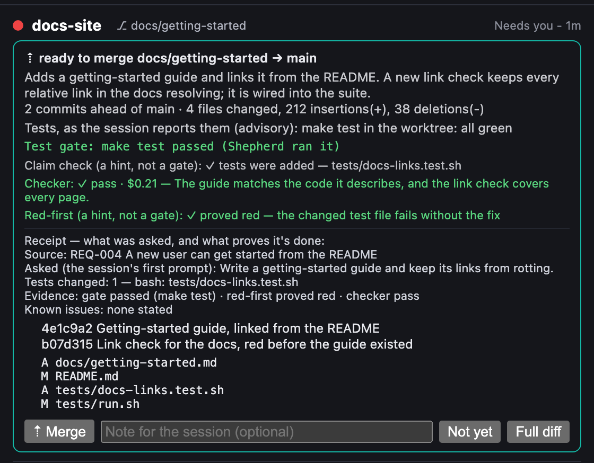

# Claude Shepherd

**A fleet console for Claude Code on macOS.** One floating panel shows every Claude Code session
you have running, tells you which one needs you, and lets you approve, answer, steer and merge them
without hunting for the right window.


## Why

Running several Claude Code sessions at once makes you the bottleneck: a session that finishes,
asks a question or hits a permission prompt sits idle until you notice, and parallel worktrees add
branches, test runs and tabs to keep track of. Shepherd puts all of that on one screen:

- **Who needs you, right now.** Each project is a card that reads **Needs you** only when there is
  something for you to press.
- **Answer from the panel:** approve or deny a tool, answer a question, or review and merge a unit,
  without finding the tab or typing into a window.
- **Parallel work that lands safely.** Units ask to merge; Shepherd checks the request with its own
  git, can run the tests itself, and closes the tab afterwards.

It runs inside [Hammerspoon](https://www.hammerspoon.org) on status files that Claude Code hooks
write on your Mac, with no server or account of its own. Its one default network call reads your
plan usage from api.anthropic.com with your existing Claude Code login.

## Feature tour

Every feature below has a reference page one click away. The panel lists the same features under
**☰ → ✨ Features list**.

### See

- [**Fleet dashboard**](docs/fleet.md#statuses): every session is a live tile: working, needs you,
  ready, or errored.
- [**How each turn ended**](docs/fleet.md#statuses): a finished card says whether its last turn got
  done, made progress, only planned, did nothing, got blocked, or needs follow-up.
- [**What each session is working on**](docs/fleet.md#what-each-session-is-working-on): every card
  says what its session is on, from your latest prompt, with the tool running now and the skill in use.
- [**Project cards & instances**](docs/fleet.md#project-cards-and-instances): a repo and its
  worktrees share one card, led by the instance that needs you, with every instance a click away.
- [**Transcript peek**](docs/fleet.md#the-detail-panel): read a session's recent messages, and
  search them, inside the panel.
- [**Find in fleet**](docs/fleet.md#search-groups-and-bulk-actions): search every session's
  transcript and the audit ledger for the session that touched a file or ran a command.
- [**Groups & labels**](docs/fleet.md#search-groups-and-bulk-actions): rename tiles, sort them into
  groups, and filter the grid to one group.
- [**Worklist (My List)**](docs/fleet.md#my-list): a checklist beside the fleet that imports each
  project's `TODO.md`, so you can verify what an automation says it finished.
- [**Needs a live run**](docs/fleet.md#my-list): `- [~]` and `(needs live run)` TODO lines get a
  ▶ live run chip in My List, and a toggle that shows only them.
- [**User stories**](docs/fleet.md#user-stories-tab): view and edit a project's
  `spec/product/user-stories.md` in a detail-panel tab.
- [**On purpose**](docs/fleet.md#on-purpose-tab): a repo's `DECISIONS.md` says what it does on
  purpose; sessions and the merge checker read it, and a detail-panel tab adds to it.
- [**Audit ledger & insights**](docs/usage-and-cost.md#the-audit-ledger): an optional local log of
  everything that happens, with fleet insights, decision provenance and session history.
- [**Cost & token analytics**](docs/usage-and-cost.md#cost-and-tokens): per-session and fleet token
  use, estimated dollars, and a 14-day chart.
- [**Plan usage meter**](docs/usage-and-cost.md#plan-window-bars): your real 5-hour and weekly plan
  usage, with a warning at every point past 90%.
- [**Commits today and this week**](docs/usage-and-cost.md#commits-today-and-this-week): your
  commits and lines changed per day and project, from local git, each linked to its session.
- [**Where the time went**](docs/usage-and-cost.md#where-the-time-went): time lost to waits, limits, stalls and errors.
- [**How often each skill works**](docs/providers-and-integrations.md#how-often-each-skill-works): runs and ok-rate per skill, hand-labelled.
- [**Shift report**](docs/usage-and-cost.md#shift-report): a summary of what the fleet did while you
  were away.

### Steer

- [**Jump, nudge, stop, clear**](docs/controls.md#the-detail-panel): focus a session's tab, send it
  a message, stop its turn, or clear or compact it, from its tile.
- [**Pinned links**](docs/controls.md#pinned-links): a session pins up to 8 links (its preview, its
  PR, a file in its worktree) with `cc-pin.sh`, and they show as chips on its card.
- [**cc-send**](docs/automation.md#send-a-prompt-from-a-shell): `cc-send.sh <project|session> "prompt"
  --wait` hands a live session a prompt from any shell and prints its reply.
- [**Cross-repo tickets**](docs/automation.md#cross-repo-tickets): `cc-ticket.sh file --repo <repo>` hands
  another repo's sessions work, and their replies and closing note come back to you.
- [**Answer questions from Shepherd**](docs/approvals-and-policies.md#answer-questions-from-shepherd):
  a session's question shows up on its card as buttons, and your click goes straight to the session.
- [**Decisions inbox**](docs/approvals-and-policies.md#decisions-inbox): a question with a sensible
  default doesn't stop the session (`cc-decide.sh`); answer it later in ☰ → Inbox.
- [**Spawn new sessions**](docs/controls.md#spawn-new-sessions): start a session in any project with
  an editor, permission mode, provider and first task, or from a saved preset.
- [**Rewind & checkpoints**](docs/fleet.md#the-detail-panel): see each turn's restore point and the
  files it changed, then open Claude Code's rewind picker.
- [**Global hotkeys**](docs/controls.md#global-hotkeys): approve, jump to whoever needs you, cycle,
  spawn and show the panel from any app.
- [**Stream Deck**](docs/controls.md#stream-deck): sessions and fleet actions on physical keys, with
  local voice dictation.
- [**Remote control**](docs/providers-and-integrations.md#remote-control-claudeai-and-mobile): new
  sessions can be driven from claude.ai or the Claude app.

### Automate

The automatic behaviours here are off until you turn them on, except handoff notes.

- [**Task queue & auto-feed**](docs/automation.md#task-queue): line up tasks per session, feed the
  next when one finishes, and route a project's tasks to whichever session is free.
- [**Task packets**](docs/automation.md#task-packets): a queued task carries the code it cites,
  repro and done-when, and isn't fed while that code has moved.
- [**Prompt templates**](docs/automation.md#prompt-templates): reusable, versioned prompts with
  variables filled in at send time.
- [**Model auto-routing**](docs/automation.md#model-auto-routing): a queued task switches the
  session to a cheaper or stronger model based on how hard it looks.
- [**Auto-respawn & auto-continue**](docs/automation.md#auto-respawn-and-auto-continue): relaunch a
  session that died mid-turn, or resume one frozen on an API error, within retry budgets.
- [**Handoff notes**](docs/automation.md#handoff-notes): each finished turn leaves a note; after
  /clear the new session is told where it is, and a respawned session starts with it.
- [**Session mailbox**](docs/automation.md#session-mailbox): Shepherd leaves a session a message
  that arrives at its next turn end or start, and types it only where typing is safe.
- [**Resume at the limit reset**](docs/automation.md#resume-at-the-limit-reset): a session stopped
  by a usage limit carries on by itself at the reset, once per window, with Resume now and Cancel on its card.
- [**Auto-compact with notes**](docs/automation.md#auto-compact-with-notes): sessions compact at 85%
  of their window, write their notes just before, and get them back right after.
- [**Automation rules**](docs/automation.md#automation-rules): when a session finishes, errors or
  stalls, log it, relabel it, nudge it or feed it.
- [**Automation dry run & trace**](docs/automation.md#dry-run-and-the-automation-trace): see what
  automation would do before it does it, and what it did, refused and why, newest first.
- [**Routines**](docs/automation.md#routines): spawn a session or push a digest on a cron schedule.
- [**Coach**](docs/automation.md#the-coach): weekly or from a card, Sonnet reads a repo's last sessions and
  suggests CLAUDE.md edits with evidence; Apply commits CLAUDE.md alone.
- [**Notifications & escalation**](docs/automation.md#escalation-and-watchdogs): louder nags, macOS
  banners and phone pushes when a session has waited on you too long or stalled.
- [**A/B compare**](docs/automation.md#ab-compare): run one task as 2–4 variants in separate
  worktrees, score them, and keep the winner.

### Merge safely

- [**New worktree tab**](docs/merging-and-batches.md#new-worktree-tab): start a unit in a new
  Claude tab with the prompt to enter its own worktree already typed in.
- [**Ready to merge**](docs/merging-and-batches.md#ready-to-merge): a finished unit asks to merge;
  review its commits, diff and tests, and **Merge** rebases, tests and fast-forwards main.
- [**Merge gates**](docs/merging-and-batches.md#merge-gates-shepherd-runs-the-tests-itself):
  Shepherd runs the project's suite itself, before the merge and again on main after it.
- [**Merge checker**](docs/merging-and-batches.md#the-checker-a-read-only-review-of-every-merge-request):
  every merge request gets red flags from the diff and a read-only Sonnet review; a batch unit
  merges only on a pass, and 🔎 Verify reviews any session.
- [**Red-first proof**](docs/merging-and-batches.md#the-red-first-proof-do-the-new-tests-fail-without-the-fix):
  the unit's changed tests run on the merge-base without its fix, and the review says whether they fail.
- [**Requirement ids and merge receipts**](docs/merging-and-batches.md#requirement-ids-and-the-merge-receipt):
  Shepherd mints REQ ids per repo, and every review shows what was asked and what proves it's done.
- [**Claude drives a batch**](docs/merging-and-batches.md#claude-drives-a-batch): a session proposes
  several units, you approve once, and it opens their tabs and hands out the tasks.
- [**Overlap radar & unit order**](docs/merging-and-batches.md#overlap-radar-and-unit-order): worktrees
  that touch the same files are flagged with which to merge first, and a batch unit can wait for others.
- [**Coverage index**](docs/merging-and-batches.md#coverage-index-a-batch-says-what-it-covers): a batch
  built from an issue list can't be approved until every issue is covered by a unit or triaged.
- [**Worktree leases**](docs/fleet.md#worktree-leases): each unit's worktree gets its own port and
  database path, stated in its prompt and shown on its card, and freed when the worktree goes.
- [**Tab bridge**](docs/merging-and-batches.md#the-tab-bridge): a small VS Code extension that
  closes or selects exactly one Claude tab, so finished units close their own tabs.

### Stay safe

- [**Headless approvals**](docs/approvals-and-policies.md#headless-approvals-the-gate): risky tools
  wait for your Approve or Deny in the panel, with no window switching.
- [**Always-ask commands**](docs/approvals-and-policies.md#always-ask-commands): `git push`,
  `rm -rf`, history rewrites and publish always wait for your click; no autopilot or rule passes them.
- [**Talk mode**](docs/approvals-and-policies.md#talk-mode): one click makes a session discussion
  only; it can read and talk, but its edits and commands that change things are denied.
- [**Worktree fence**](docs/approvals-and-policies.md#worktree-fence): a session can't edit another
  worktree of its repo or run git that changes one, except its own approved merge into main.
- [**Policy bundles & autopilot**](docs/approvals-and-policies.md#policies): reusable allow and deny
  rules per session or fleet, and a time-boxed autopilot.
- [**Shared-window guard**](docs/controls.md#sessions-that-share-a-window): Shepherd won't type into
  a window that hosts several sessions, because the keys could land in the wrong tab.
- [**Keep awake & screen lock**](docs/controls.md#keep-this-mac-awake): keep the Mac awake for long
  runs, and lock the screen without pausing the sessions.
- [**Diagnostics**](docs/troubleshooting.md#start-with-diagnostics): a one-screen health check of the
  hooks, the gate, the panel heartbeat, the tab bridge and the ledger, with fixes.

### Make it yours

- [**Visual theme editor**](docs/customizing.md#appearance): 50 themes, an editor for every colour
  with live preview, and theme export and import.
- [**Layout & density**](docs/customizing.md#layouts): cards, bar, contrast or dots, with scale,
  tile width, font, density and reduced motion.
- [**Faster rendering**](docs/customizing.md#faster-rendering): the grid is rebuilt only when a
  card's content changed; otherwise only the ages update.

### Connect

- [**Providers & models**](docs/providers-and-integrations.md#providers-and-models): Claude models,
  other companies' models through a gateway, or local models, with no API keys stored.
- [**Agent profiles**](docs/providers-and-integrations.md#agent-profiles): saved agents with a role,
  skills, MCP servers and knowledge folders, spawned in one click.
- [**Find-only audit**](docs/providers-and-integrations.md#find-only-audit): an auditor that reads the
  code and drives the app, can write only its findings, and fills My List with them.
- [**MCPs & Skills**](docs/providers-and-integrations.md#mcps-and-skills): what MCP servers, skills
  and command-line tools your sessions can reach.
- [**SSH status bridge**](docs/providers-and-integrations.md#ssh-status-bridge): sessions running on
  another machine, mirrored as tiles.



## How it works

```text
Claude Code session ──hooks──► ~/.claude/cc-status/<session>.json ──► Shepherd panel (Hammerspoon)
       ▲                                                                       │
       └── gate hook waits for a decision file ◄────────── Approve / Deny ─────┤
VS Code window ◄── tab bridge extension: close or select one Claude tab ◄──────┘
```

- **Hooks write, the panel reads.** Hooks ([cc-status.sh](cc-status.sh) and friends) write one JSON
  file per session. The panel, Lua inside Hammerspoon, reads them every second.
- **Answers are files, not keystrokes.** Approvals, held questions, merges and batches wait for a
  decision file bound to their request, so they work in any editor.
- **Keystrokes only where they're safe:** never into a window that hosts several sessions. The
  **tab bridge**, a small VS Code extension, closes or selects exactly one Claude tab.

More in [Development → How it fits together](docs/development.md#how-it-fits-together).

## Install

You need macOS; the installer gets the rest.

1. Download the repo (**Code → Download ZIP**, then unzip) or `git clone` it.
2. Double-click **`Install Shepherd.command`** (a downloaded copy: right-click → **Open** the first
   time). It installs what's missing (Xcode tools, Homebrew, `jq`, `lua`, `node`, Hammerspoon,
   VS Code, Claude Code), then Shepherd. Already have the tools? Run `make setup`.
3. Once, by hand: allow **Hammerspoon** in Privacy & Security → **Accessibility**, and sign in to
   Claude in VS Code. The panel appears top-right.

**Upgrade** after a `git pull` with `make setup` (not `make install`), then reload Hammerspoon and
any VS Code window that was already open. **Uninstall** with `Uninstall Shepherd.command` or
`make uninstall`; your settings and history stay. Details: [docs/install.md](docs/install.md).

## The daily workflow

One unit of work = one branch = one worktree = one Claude session.

1. **Start a unit:** right-click a card → **New worktree tab…**. The tab works in its own worktree.
2. **Watch the cards** and answer approvals and questions as they come up.
3. **Merge:** a finished, green unit asks to merge. Review it on its card and press **Merge**; it
   rebases, tests and fast-forwards main, then its tab closes.
4. **Or hand over a batch:** one session runs several units in parallel. You approve the batch once,
   and choose whether its units may merge on green.

Every session follows these rules from `~/.claude/CLAUDE.md`
([methodology/CLAUDE.md](methodology/CLAUDE.md)). See the whole loop in the
[worktree demo](docs/merging-and-batches.md#try-it-the-worktree-demo) (`make demo`).

## Configuration

**⚙ Settings** covers nearly everything, with one line of explanation per switch. It writes
`~/.claude/cc-config.json`; [cc-config.example.json](cc-config.example.json) documents the keys, and
a fresh install starts from [defaults/cc-config.json](defaults/cc-config.json) (`make setup` adds
any key you haven't set).

**On out of the box:** auto-continue (`autoContinue`), respawn (`respawn`), resume at the limit
reset (`resume`), auto-compact (`compact`), worktree leases (`lease`) and the audit ledger
(`ledger`), plus held questions, Remote Control for spawned sessions and ending leftover processes
that have no tab. The queue, rules, routines and escalation start off. Reference:
[docs/configuration.md](docs/configuration.md).

## Safety model

- **The gate is opt-in:** ⚙ Settings → Approvals → **Headless approvals** makes the tools in
  `gate.tools` (Bash, Write, Edit, MultiEdit, NotebookEdit) wait for your Approve or Deny.
- **Always asked, armed or not:** `git push`, `rm -rf`, history rewrites and publishing are held for
  your click, and nothing automatic can approve them.
- **Approving without you** needs the gate armed and a switch you turned on: an `autoAllow` pattern,
  an attached policy bundle, Autopilot or approve-repeats. `autoDeny` always wins.
- **When the gate can't answer** (it's off, the tool isn't gated, Shepherd wasn't running, or 120
  seconds pass), Claude Code's own permission mode decides; in Auto or Bypass mode there may be no
  prompt. The gate never approves on a timeout.
- **Never automatic:** answering a question, merging without your **Merge** or a batch grant, and
  closing a session you didn't ask to close (except a merged unit's own tab and an idle leftover
  process with no tab).
- **Remote Control is on by default** for sessions Shepherd spawns, so anyone with your claude.ai
  account can type into them. Turn it off in ⚙ Settings → Spawn and in Claude Code's `/config`.

Full detail: [docs/approvals-and-policies.md](docs/approvals-and-policies.md#the-safety-model).

## Troubleshooting

- **☰ → 🩺 Diagnostics** checks the hooks, gate, heartbeat, tab bridge and ledger and says how to
  fix what's wrong. `make doctor` checks the command-line tools.
- **Is it running?** Shepherd is Lua inside Hammerspoon, so `pgrep shepherd` finds nothing;
  `~/.claude/cc-fleet.sh alive` reads the panel heartbeat.
- **A change didn't take?** Run `make setup`, reload Hammerspoon and older VS Code windows. Logs:
  `tail -f ~/.claude/cc-shepherd.log`. More: [docs/troubleshooting.md](docs/troubleshooting.md).

## Documentation

| Page | What's in it |
|------|--------------|
| [Install](docs/install.md) | Install, upgrade, uninstall, what the installer changes, the tab bridge, the Dock launcher |
| [Fleet](docs/fleet.md) | Statuses, project cards, Instances, the detail panel and its tabs, search, groups, My List |
| [Controls](docs/controls.md) | Clicks and menus, detail-panel buttons, shared windows, spawning, hotkeys, Stream Deck, awake and lock |
| [Approvals and policies](docs/approvals-and-policies.md) | The safety model, the gate, policies and bundles, answering questions |
| [Merging and batches](docs/merging-and-batches.md) | Worktree tabs, ready to merge, merge gates, batches, the demo, the tab bridge |
| [Automation](docs/automation.md) | Queue, templates, routing, auto-model, respawn, escalation, rules, routines, A/B compare |
| [Usage and cost](docs/usage-and-cost.md) | Context bars, plan usage, cost, commits, the audit ledger and its views |
| [Providers and integrations](docs/providers-and-integrations.md) | Providers and models, agent profiles, MCPs and skills, Remote Control, the SSH bridge |
| [Make it yours](docs/customizing.md) | Layouts, themes, colours, sizing |
| [Configuration](docs/configuration.md) | Settings tabs, `cc-config.json`, the files Shepherd keeps, environment variables |
| [Troubleshooting](docs/troubleshooting.md) | Diagnostics, "is it running?", logs, common problems, known limits |
| [Development](docs/development.md) | Architecture, tests, deploying, screenshots |
| [Reverse-engineering user stories](docs/reverse-engineering-user-stories.md) | Writing `spec/product/` for an existing project |

Also: [methodology/CLAUDE.md](methodology/CLAUDE.md) (the working rules sessions follow),
[demo/GUIDE.md](demo/GUIDE.md) (the worktree demo), [CHANGELOG.md](CHANGELOG.md) (what changed),
and [context.md](context.md) (orientation for working on Shepherd itself).

## License

[MIT](LICENSE).
