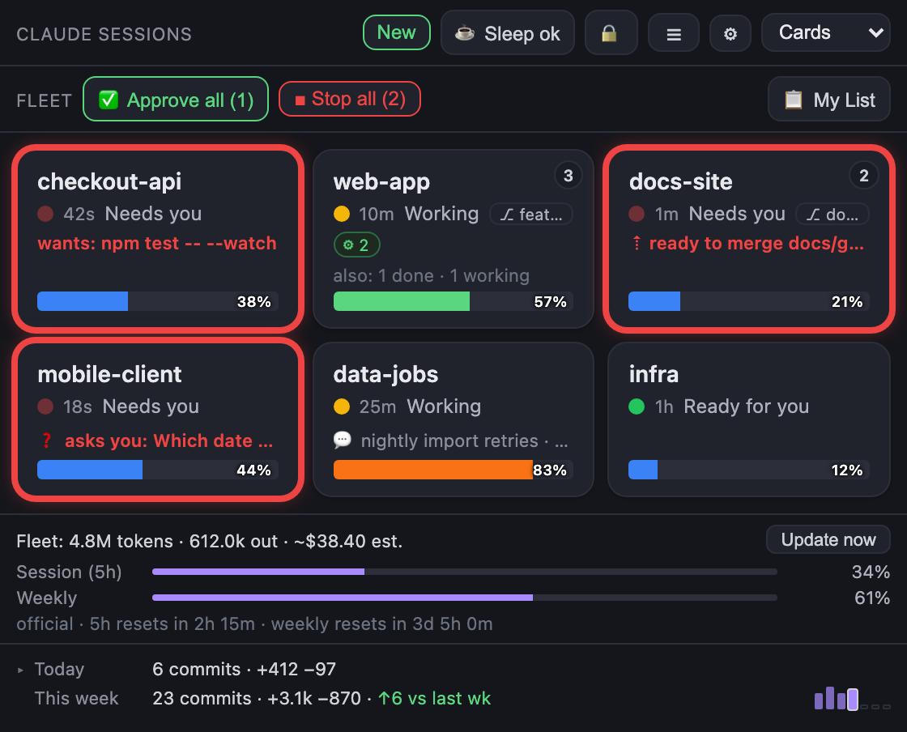

# The fleet panel

[← README](../README.md) · [Controls](controls.md) · [Usage and cost](usage-and-cost.md)

What the panel shows: statuses, project cards, the Instances view, the detail panel and its tabs,
search and groups, and My List.



## Statuses

| Status     | Card says         | Colour          | Set by                       | Meaning                                  |
|------------|-------------------|-----------------|------------------------------|------------------------------------------|
| `idle`     | Idle              | gray            | SessionStart                 | Session open, nothing happening yet      |
| `working`  | Working           | amber           | UserPromptSubmit, Pre/PostToolUse, PostToolUseFailure | Claude is doing work                |
| `approval` | Needs you         | red (pulsing)   | PermissionRequest, Notification (permission), AskUserQuestion | Claude needs a permission or your answer |
| `done`     | Ready for you     | green           | Stop, Notification (idle)    | Claude finished its turn                 |
| `error`    | Needs you, Retrying, or Heads-up | red, or gray for a heads-up | StopFailure, and the transcript | The turn died on an API error or a usage limit |

Instances rows and the Stream Deck show an errored session as **Error** in magenta.

- Sessions are keyed by their **session_id**, so two sessions in one folder never collide into one
  tile. A tile goes away when its session ends (SessionEnd).
- **Needs you** is one decision: a card ranks as needing you only when a live counterpart will
  receive your answer *and* the card offers something that changes the outcome (an approval, a
  held question, a merge to review, a batch to approve, a blocked unit, an errored turn to
  Continue). Anything else is a quiet
  **Heads-up** with one line saying why (see
  [Merging and batches → The card](merging-and-batches.md#the-card)).
- A working session waiting inside one tool for over a minute says which tool and for how long
  (*Working - Bash 9m*), so a long build reads as work.
- A done or idle session with live subagents or a Workflow reads **Running N agents**, one with a
  background shell job still going reads **Running 1 job** (both: *Running 2 agents · 1 job*), and
  a batch driver whose units are working reads **Driving N units**. The underlying status is unchanged;
  this is display only.
- A **Ready for you** card says how its last turn went, read from the transcript since the newest
  prompt: **done** (a `TODO.md` line ticked to `[x]` by an edit or a `sed -i`, a commit, or a merge
  finished with `cc-merge.sh done --result merged`), **made progress** (edits,
  commands that change things, test runs), **only planned** (it only read, or explained at
  length), **did nothing**, **blocked** (it stopped on a denial or an API error) or **needs
  follow-up** (it asked you, put up a plan, or ended on a question). Its Instances row says the
  same, and the ledger records a `turn_outcome` event. What Shepherd sends on its own
  (auto-continue, a rule's nudge or continue, the self-summary) starts with `[shepherd]`, so those
  turns never read as yours; your own **Continue** click still types a plain `continue`. Task
  notifications and compaction summaries don't count as prompts either. A batch unit, which only
  ever gets its driver's messages, is labelled from the newest of those. When the turn's prompt is
  further back than the last 256KB of the transcript, the label covers that whole 256KB.
- A `done` tile **self-heals back to `working`** when the transcript shows the turn resumed (the
  model wrote a new line, or you typed a fresh prompt). In Auto mode or the VS Code extension, a
  text-only reply or an auto-continued turn can land before the `working` hooks do, so a tile no
  longer sticks on "Ready for you" while it's working (`status.resumeSlack`, default 2s). IDE
  file-open lines are ignored, so opening a file never flips it.
- An **errored** tile (a turn frozen on an API error such as `ECONNRESET`) shows the error with a
  coarse cause: `[budget exceeded]`, `[timeout]`, `[runtime error]`, `[model error]`,
  `[user cancelled]`. It reads **Needs you**, and its Approve button becomes **Continue**. A
  transient connection fault the session is still retrying reads **Retrying** (a heads-up) for up
  to 75 seconds before it goes red. An error you stopped yourself, and one on a session that has
  exited, read **Heads-up**: nothing is retrying them. A usage limit reads `[budget exceeded]` with
  Claude Code's message, which names the reset time (*You've hit your limit · resets 3pm*), and
  auto-continue skips it: continuing only fails again until the limit resets. Instead the session
  [resumes at the reset](automation.md#resume-at-the-limit-reset): its card says
  **resumes at 3:00pm**, with **Resume now** and **Cancel**, and is a **Heads-up** rather than a
  red Needs you until the reset comes.
- Only a genuinely idle card **dims**, once its status file is more than 90 seconds old. A card
  waiting on you, a quiet "Ready for you" and a heads-up never dim.
- Each tile shows time-in-state, a context-fullness bar
  ([Usage and cost](usage-and-cost.md#context-fullness-bar)), and on an approval the **exact
  command** being requested (for example `wants: npm test -- --watch`).

### What each session is working on

Each card's meta line says what its session is working on, so a row of cards that all read
**Working** can be told apart without opening them:

- **The label** is your latest prompt to the session, cut to its first line and 48 characters.
  Claude Code keeps it in the transcript's `last-prompt` records, so it survives long turns: the
  prompt itself can be far back, and the label still reads it from the last 64 KB that Shepherd
  already reads each second. Shepherd's own sends (`[shepherd] …`) and bare slash commands
  (`/compact`) don't count; the prompt before them does.
- A session nobody has typed to reads the last prompt its status file recorded, and then its first
  prompt. A batch unit, which only ever gets its driver's messages, reads as its unit
  (*unit feat/working-on-label*), and a resumed one as *resume &lt;worktree&gt;*. Another
  session's message reads as its text.
- **▶ Bash** is the tool running right now, while the turn is working. It goes when the
  tool returns, and an interrupted turn shows none.
- **✦ dataviz** is the skill in use: Claude Code stamps it on every assistant message a
  skill produced, and the newest message decides, so it goes when the session moves on.

The label leads the line and the chips follow it, then the 💬 chat title of a project with two
sessions. A default-width card has room for about 25 characters, so it shows the label and clips
the rest; a wider panel shows the chips too. Anything more urgent takes the line: a held question,
an approval's `wants:`, an error, a merge, a batch, or a missing tab. The detail panel shows the
whole line, chips included, under the session's name, whatever the card shows. The transcript is
parsed again only when it changes; a remote (bridged) session shows its status file's prompt and
tool only.

## Project cards and Instances

The grid shows **one card per project**, not one per session. It's built for the parallel-worktree
workflow ([Merging and batches](merging-and-batches.md)).

- **What folds together.** A session launched at a git worktree top-level joins its repo's card:
  the main checkout and every linked worktree, whatever their folder names (identity comes from
  git, one cached `git rev-parse` per launch folder). Two sessions in one plain folder share a card
  too. A folder nested inside a repo that isn't its own repo (a scratch folder) keeps its own card,
  and A/B compare variants keep theirs so the comparison stays visible.
- **Tabs that entered a worktree.** A tab that started in the main checkout and ran `EnterWorktree`
  (into `.claude/worktrees/<slug>`, or a sibling folder) stays on the repo's card but shows the
  worktree **it is working in**: its branch, its folder in Instances (never offered to Open while
  it's there) and its `TODO.md` in My List.
- **What the card shows.** The instance that most needs you: blocked longest first (approval or
  question, then error, then stalled), then one that's still **running** (a batch's driver first),
  then the newest *finished* one you haven't jumped to yet, else the most recently active. It shows
  that instance's branch chip and an "also: 2 ready · 1 idle" line for the rest. A project with
  anything still at work reads **Working**, never *Ready for you*. A stationary lead is held for
  30 seconds so two busy instances don't swap the card every few seconds. The card is named after
  the main checkout (its relabel, if any); **Relabel** on a card renames the whole repo.
- **Double-click** a card to jump to that same instance. Once you've jumped to a finished instance
  it stops outranking the others until it finishes again (remembered across reloads).
- **The corner button** (top-right of every card) opens the **Instances view**: every instance
  with its folder, branch, status, age and what it's waiting on, with **Focus** or **Details**
  (which opens that instance's detail panel). It also lists hidden instances (**Unhide**) and the
  repo's **worktrees with no session**, each with **Open** (only a worktree the repo itself lists
  can be opened). The button shows the instance count, and a pulsing dot when *another* instance
  needs you. Right-click → **Instances…** opens the same view.
- **＋ New worktree tab** starts a new unit from the Instances header
  ([Merging and batches → New worktree tab](merging-and-batches.md#new-worktree-tab)).
- **One worktree, one agent.** A linked worktree another live session is working in gets no
  second agent: a spawn, **Respawn from cwd** or auto-respawn (which ledgers why) and **Open** are
  refused, and so is a session's own `EnterWorktree` into it (the `cc-worktree-guard.sh` hook
  denies it, naming the session that's there). The main checkout is shared, and a session whose
  process is gone holds nothing. An existing install wires the hook with `make setup`.
- The detail panel stays on the instance you selected even if the card starts showing a different
  one (the card then gets a dashed outline), so a nudge never goes to the wrong worktree.
- `stacks.enabled: false` in `~/.claude/cc-config.json` switches back to one card per session. The
  Stream Deck stays one key per session.

### Clearing finished sessions

Every Instances row has a checkbox. **Select finished** checks the sessions whose merge landed and
those finished longer than **Settings → Tile cleanup** allows (`cleanup.idleHours`, default 12;
0 = merged ones only). **Select all** checks every row that can be closed, so you can uncheck the
ones to keep. **Close selected** asks first, then closes those tabs through the tab bridge.
Shepherd re-checks every one, so a session that is working, holding a question, mid-merge or
driving a batch is never closed. Unnamed "Claude Code" tabs (a batch unit's) look identical, so they
close only when **every** unnamed tab in that window is selected. A card with two or more finished
sessions shows **🧹 N finished**, which opens Instances with them already checked. Nothing closes
on its own.

### Worktree leases

Parallel units that each run a dev server or a database would otherwise fight over one port and one
file. So each worktree Shepherd starts a session for gets its own **port** and **database path**:

- **When.** A **＋ New worktree tab**, a batch unit's tab ([Claude drives a
  batch](merging-and-batches.md#claude-drives-a-batch)) and **Open** on an Instances worktree row
  each lease the worktree they're for. The main checkout never gets one. A worktree that already
  has a lease keeps it.
- **Which.** The lowest port in `lease.portFrom`–`lease.portTo` (default 4100–4199) that no lease
  of any repo holds, and `<lease.dbDir>/<repo>-<unit>-<port>.db` (default folder
  `~/.claude/cc-lease/db`). Shepherd creates the folder; the project creates the file.
- **How the session learns it.** Three ways:
  - the prompt states it (`PORT=4101, DB_PATH=…`);
  - at every start, `/clear` and compaction inside the worktree, a `[Shepherd: lease]` part of the
    SessionStart context repeats it;
  - `$(git rev-parse --git-dir)/shepherd-lease.env` holds `PORT=` and `DB_PATH=`. A project can
    load it with `set -a; . "$(git rev-parse --git-dir)/shepherd-lease.env"; set +a`, or with a
    dotenv reader. The file lives in git's own folder for the worktree, so it's never committed and
    goes when the worktree does.
- **On the card.** The session's card shows **:PORT**; its tooltip gives the database path.
- **Release.** Shepherd checks the leases every minute (with the commit counts, never on the tick).
  Once a worktree is gone its lease is freed, and the database file Shepherd named goes with it,
  along with SQLite's `-wal`, `-shm` and `-journal` files. Only files directly in `lease.dbDir` are
  deleted. A lease whose worktree never appeared (a New worktree tab prompt never sent) is freed
  after a day.
- **Where.** `~/.claude/cc-lease/<encoded main checkout>.json`, one file per repo. Only Shepherd
  writes it; `uninstall.sh --purge` removes it. `lease.enabled: false` stops new leases, and the
  cards and SessionStart stop showing the ones that exist.

### Restart the fleet in place

A Claude Code update or a reboot takes every session down at once. **☰ → ♻️ Restart fleet** brings
them back, each with its conversation.

- **The snapshot.** Shepherd keeps `~/.claude/cc-restart.json` in step with the fleet. It is
  rewritten (whole, then renamed into place) whenever something changes. For each session it holds
  the id, folders, editor, window, permission mode, model, and whether a turn was in progress. The
  hooks delete a session's status file the moment it ends, so an ended session stays in the
  snapshot for `restart.keepHours` (default 72). A session Shepherd drops itself leaves it at once:
  one you closed from the panel, a pruned tile, the id a `/clear` retired, a respawned one.
- **The preview comes first.** The menu entry only shows what a restart would do. It opens
  nothing. Every session is in one of three groups:
  - **Would reopen** (ticked): the sessions that went down together. That is everything that ended
    within `restart.waveMinutes` (default 30) of the newest ending, plus any whose status file is
    still there, since a crash or a reboot ends a session without telling the hooks.
  - **Closed earlier** (not ticked): dead sessions from before that. Tick one to include it.
  - **Left alone**, each with its reason: it is running, it was already reopened, its folder is
    gone, or Shepherd can't verify that it is dead.
- **Only a verified-dead session is reopened.** Reopening a live conversation would fork it, so
  Shepherd needs proof: no session file of Claude Code's (`~/.claude/sessions/`) names the session
  under a process `ps` still shows, and the session's own recorded process is gone, or that pid
  now belongs to a process that started at another time. That recorded process must be one a
  session file named while the session was alive, so a session Shepherd first saw already dead,
  or one on a Claude Code too old to write session files, is never called dead. The same `ps` must
  also show Shepherd's own pid, or nothing counts as dead. The check runs for the preview, again
  when **Reopen** starts on a session, and once more right before a tab's link goes out.
- **Reopen** asks once, then works through the ticked sessions one at a time:

  | Editor | How it comes back |
  |--------|-------------------|
  | VS Code, Cursor | Its tab, in the window of the folder it started in, through the Claude extension's link for that session. The window must be in front, or nothing opens. Nothing is typed. |
  | kitty | `claude -r <id>` typed into its own window when that is still there at a shell prompt; otherwise a new kitty window in its folder runs it. |
  | Terminal | `claude -r <id>` in its own tab when the shell that ran it is still there and idle; otherwise a new window. |

  A kitty or Terminal session keeps its permission mode, the model its status file named, and its
  provider profile. A new window follows **Settings → Spawn → Actually launch** (`spawn.live`).
- **Continue.** Where a turn was in progress, a kitty or Terminal session gets `Continue` typed,
  once, after it is back and [can take it](automation.md#when-automation-types). If it hasn't come
  back within 5 minutes the Continue is dropped. A VS Code or Cursor tab never gets anything typed;
  its row says a turn was in progress, so you know which tabs to continue yourself.
- **Never twice.** A session is marked as reopened in the snapshot before anything launches, and a
  second **Reopen** leaves it alone ("already reopened"). The mark is taken back only when Shepherd
  knows nothing opened (the window wasn't in front, the launch was refused). It clears when the
  session's hooks write again, which makes it an ordinary live session.
- **Dry run.** With `restart.dryRun` (⚙ Settings → Automation → **Dry run**) or `automation.dryRun`
  on, **Reopen** opens nothing and records what it would have done in the
  [⚡ Automation trace](automation.md#dry-run-and-the-automation-trace).

Shepherd never ends a session to restart it. To move live sessions to a new Claude Code version,
close them (or reload the editor window) first, then use **Restart fleet**. A remote (bridged)
session is never in the snapshot.

## The detail panel

**Single-click** a tile to select it and open the detail panel. Its buttons are described in
[Controls](controls.md#the-detail-panel). Its views sit in a **tab strip**:

- **Activity** (the default): status, the **Wants** (the exact command) and **Why** (the
  assistant's reasoning before a request; both clamp to two lines, click to expand), the agent's
  current **plan and TODO list** (its latest `TodoWrite` or plan-mode plan), a live **activity
  peek** ("Doing: …", the latest assistant line), and session lineage.
- **Transcript**: up to the 60 most recent messages from the last 128 KB of the transcript, oldest
  first: your prompts and Claude's text replies, each cut to 800 characters. Tool calls, tool
  results and IDE file-open lines are skipped. A search box filters the loaded messages as you
  type. It doesn't search the whole history; use **Find in fleet** for that.
- **Rewind**: restore points, newest first (the prompt, its age, and the files changed in that
  turn), above this session's recorded activity. **↶ Rewind…** opens Claude Code's own restore-point
  picker (`/rewind`) after a confirm that states the caveat: rewind reverts Write / Edit /
  NotebookEdit changes only, not changes made through Bash.
- **Decisions**: the gate's recent decisions for this session, grouped with counts and provenance
  (*"⛔ deny Bash ×4 (autoDeny: Bash(rm*)) · 2m ago"*). `decisions.limit` / `decisions.hours` tune it.
- **Usage**: this session's token breakdown.
- **Changes**: the session folder's working tree: changed files with A/M/D/R/?? marks; click a file
  to expand its colorized, rename-aware diff. Read-only, local sessions only, with **↻ Refresh**.
  Only read-only git runs against the repo (`rev-parse`, `status`, `diff`).
- **User Stories**: shown only when the project has `spec/product/user-stories.md` (below).
- **On purpose**: the repo's `DECISIONS.md`, what the project does on purpose (below).
- **Requirements**: shown for a session in a git repo. It lists the repo's `REQ-NNN` ids and adds
  one ([Merging and batches → Requirement ids](merging-and-batches.md#requirement-ids-and-the-merge-receipt)).
- **Agents**: the session's subagents and Workflows (below).
- **Queue**: the session's task queue ([Automation → Task queue](automation.md#task-queue)).

The expensive tabs load only when opened. The **⋯** button hides tabs you don't want; your choice
(and the last-open tab) is remembered per project.

### Agents tab and background work

When a session spawns subagents or runs a Workflow, the **Agents** tab lists each one, **grouped
under a per-Workflow header with a running/total rollup** (`⚙ Workflow wf_… · N agents ·
M running`). Each row is labeled by the agent's **actual task prompt**, not its auto-generated slug,
with a green running dot and its latest "Doing:" line. Click a row to read that agent's recent
output. It's read from the `subagents/` folder Claude Code writes beside the transcript; no extra
hooks.

While background work is running, the tile shows a green **⚙ N** pill, and a done or idle session
reads **Running N agents** instead of "Ready for you", so a session busy behind the scenes isn't
mistaken for one waiting on you (`subagents.activeWindow`, default 45s).

Background **shell jobs** count too: a Bash command the session started with `run_in_background`
keeps the card at **Running 1 job** until its completion notice lands in the transcript or the
session stops it. A server or watcher (`deno task dev`, `npm start`, `http.server`, `--watch`,
`tail -f`, a `serve.ts`) never finishes, so it doesn't count, and any other job stops counting
30 minutes after it started (`subagents.jobMaxMinutes`). While a job counts, the card also isn't
offered to Close selected, closed after its merge, or ended as a tab-less leftover.

### User Stories tab

Shown **only when** the session's project has `spec/product/user-stories.md` (it appears and
disappears live if the file is created or deleted). It lists the stories grouped by capability area
(the `##` headings), with **+ Add story** per area; **double-click** a story to edit it inline,
**✕** to delete it, and an explicit **Save** (staged edits, with an "● unsaved" indicator). A soft
**⚠** flags any story that doesn't read "As a …, I want …, so that …". The file's other content (title, intro,
headings, prose, fenced code) is kept **verbatim**: an unedited file round-trips byte for byte.
Saves are guarded against an external edit and written atomically.

To **generate** these files for a project that doesn't have them yet, see
[Reverse-engineering user stories](reverse-engineering-user-stories.md). Shepherd's own
[spec/product/spec.md](../spec/product/spec.md) and
[spec/product/user-stories.md](../spec/product/user-stories.md) are a worked example.

### On purpose tab

Sessions and reviews tend to "fix" a project's deliberate choices, because nothing says they're
deliberate. A `DECISIONS.md` at the repo root says so, one entry per choice:

```md
## Tests shell out to the real make

Why: install.test.sh proves the Makefile itself, so a stub would test nothing.
Date: 2026-09-29
```

The **On purpose** tab is shown for any local session in a git repo, even before the file exists.
It lists each entry's what, why and date, and a form adds one (**What**, **Why**, **Date**,
defaulting to today). The first entry creates `DECISIONS.md` with a short header. An add is appended
at the end of the file, and the rest of the file is left as it was. Like the User Stories save, the add
re-reads the file first and is **refused if it changed since the tab read it**. Your entry stays in
the form, so **Reload** and **Add** again. The file is plain Markdown, so you can edit it by hand too.
A file without `##` entries is shown as text.

Who reads it:

- **Sessions.** At every start, `/clear` and compaction, a session in a repo with `DECISIONS.md`
  gets one line pointing at it (the `onpurpose` part of Shepherd's session context).
  [methodology/CLAUDE.md](../methodology/CLAUDE.md) says to read it before changing anything it lists.
- **The merge checker** reads the base branch's copy (`git show main:DECISIONS.md`) and doesn't flag
  a choice it lists. An entry the change itself adds is reviewed as part of the change, so a unit
  can't exempt its own code.
- **Handoff notes** name the file, so a respawned session sees it too.

## Session observability

All derived locally from the transcript Shepherd already reads, with no extra hooks:

- **Auto-title** (off by default, `autoTitle.enabled`): names an unlabeled tile from its first
  prompt. A manual relabel always wins.
- **Loop watchdog** (off by default, `escalation.loop.enabled`): a ⟳ badge when a working session
  keeps repeating the same tool call (for example re-running a failing command). Different edits
  of one file are different calls, and so are different chunks of one file read one after
  another; the same edit attempted again, or the same chunk read again, is a repeat. Detection only.
- **Stuck-session watchdog** (off by default, `escalation.hung.enabled`): a session that stays `working` with no transcript
  growth for `escalation.hung.minutes` gets ⏳ and a purple ring
  ([Automation → Escalation](automation.md#escalation-and-watchdogs)).
- **PR / MR status** (off by default, `prStatus.enabled`, needs the GitHub CLI `gh`): a clickable
  **"PR #N open / merged"** badge per repo, polled with `gh pr view`. Status only; Shepherd never
  opens or edits PRs.
- **Risk indicator** (off by default, `risk.enabled`): a per-session ⚠/▲ badge computed from that
  session's ledger history (deny rate, auto-deny hits, timeout fallbacks, slow approvals, tool
  volume). Indicator only; it never blocks.
- **Same-folder collision** (off by default, `collision.enabled`): an amber ring and
  "⚠ shared dir" when 2+ **active** sessions share a working directory, so two agents don't
  silently clobber each other's edits. `useGitRoot` groups by repo root instead. Detection only.
- **Session lineage**: auto-respawns and `/clear`s mint a new session id for the same project. The
  detail panel shows a one-liner ("3rd session today · 2 auto-respawns · 1 clear") and a tile gets a
  **♻️N** badge once the churn adds up (needs the audit ledger).
- **Run score, history, insights and cost** are in [Usage and cost](usage-and-cost.md).

## Search, groups and bulk actions

- **🔍 Filter sessions** (☰ menu) reveals a filter bar that scopes the grid as you type. Every word
  must match something about the session: its name or label, folder path, project, status id
  (`approval`, `working`, `done`, …), group, branch or chat title.
- **🔎 Find in fleet** (☰ menu) searches every session's **transcript**, live *and* ended, plus the
  audit ledger: "which session touched `auth.ts`?", "who ran that migration?". Click a hit to select
  the live session (or open an ended one's audit timeline). Instant with
  [ripgrep](https://github.com/BurntSushi/ripgrep) installed; it falls back to grep otherwise.
  `search.maxResults` caps the hits. Two folders inside the ledger are never searched:
  `quarantine/` and `exports/` (an audit export is a copy of ledger lines, so its events would
  show twice).
- **Groups**: right-click → **Set group…** tags a session into a named cohort, kept by the stable
  project identity so it survives close and reopen (`~/.claude/cc-groups.json`). When groups exist,
  a chip row scopes the grid to one group (it composes with the filter).
- **Bulk actions**: the **Fleet** bar acts on whatever is visible after filtering: **Approve all**
  waiting sessions (shown from one), or **Stop all** working ones (shown from two, after a
  confirm). The buttons show live counts. There is no bulk nudge.
- **Hide tile**: right-click → **Hide tile** takes a session off the grid without touching it; it
  keeps running and Shepherd keeps managing it. Restore it from **☰ → 🙈 Hidden sessions**.
- **Timeline**: the detail panel's **📜 Timeline** button opens the audit ledger scoped to that one
  session's history (needs the ledger).

## My List

A checklist built into the panel: add, work, check off. The **📋 My List** button on the right of
the FLEET row swaps the session tiles for the list (click again to go back).

- **Scopes**: a **MASTER** rollup, a **Generic** list, and one tab per project that **has a live
  session or still owns a saved list**, labeled with the project's relabel name. Lists are stored in
  `~/.claude/cc-worklist.json`, keyed by the stable launch-folder identity. A project's tab and its
  items **persist whether or not a window is open**, until you clear the list.
- **TODO.md import**: **⇪ Import TODO.md** pulls a project's `TODO.md` checkboxes into its tab as
  verify-me items (the file's `[x]` shows as a **✓ auto** chip; the row checkbox stays yours). Once
  imported, the tab **re-syncs whenever the file changes**. A repo's main checkout and its worktrees
  share one tab, and the import reads **every worktree's** `TODO.md`: a line in several copies
  imports once, a line that exists only on a branch carries a **⎇ branch** chip until it reaches
  main's copy, and a removed worktree's items stay. The file format is in
  [methodology/CLAUDE.md](../methodology/CLAUDE.md). A [find-only audit](providers-and-integrations.md#find-only-audit)'s
  findings file imports with it: each finding carries a **🔍 severity** chip and is never marked done.
- **▶ live run**: some lines can only be checked by a live run (deploy, then look). A `TODO.md` line
  written `- [~] text`, or carrying `(needs live run)` / `(live check)` on a `[ ]` or `[x]` line, shows
  a **▶ live run** chip. A `[~]` line is never done; a marked `[x]` keeps its **✓ auto** chip too.
  Flipping only the checkbox (`[ ]` → `[~]` → `[x]`) keeps the same item. The **▶ live run N**
  toggle beside the filter box keeps only those lines on a project tab or **MASTER**, together with
  any filter text. It stays on across tab switches. It only appears where such a line is open, or
  while it's on. The Done drawer and the Archive are never filtered, and **✓ Mark all N done** hides
  itself while the toggle is on.
- **Filter**: the box under the tabs filters **whichever tab you're on**: a project tab that
  project, **MASTER** the rollup, **🗄 Archive** every archived row. It is case-insensitive and
  every word must match. It searches the subject, the **details**, the expected date (`2026-09`
  filters a month) and, on MASTER and Archive, the project the row came from. The count beside it
  reads **N / M shown**; **Esc** clears it. Done drawers are not filtered, and **✓ Mark all N done**
  hides itself while a filter is on.
- **The item editor**: **＋ Add an item…** (or clicking a row) opens one editor with a **Subject**
  (Enter saves), **Details** (free-form notes), a **Checklist** of sub-steps (ticking a step saves
  immediately; the row shows a `2/5` chip that turns green when all are done), and an **Expected
  date** (defaults to today; **◀ ▶** nudge it a day, **↻** resets, **Clear** drops it). Esc or a
  backdrop click discards; **Delete** removes the item after a confirm.
- **The list**: each row shows its subject and date chip (dim normally, amber for **Today** /
  **Tomorrow**, red once **overdue**), a 📝 when it has details, and its checklist progress.
  Checking a row moves it to a collapsed **Done** area (ordered by due date) with both its expected
  date and a **✓ completion date**. **✕** deletes it; **Clear** empties Done for that scope.
- **✓ Mark all N done**: ticks off everything still open on the tab you're looking at, after a
  confirm that states the count. On **MASTER** it marks every project's open items, each in its own
  list.
- **🗄 Archive**: once a day, work you finished more than **10 days** ago moves out of the live list
  into `~/.claude/cc-worklist-archive.json`, and the **Archive** tab shows it, newest first and
  read-only. Nothing is deleted. The archive is fetched **only when you open that tab**.
  `worklist.archiveAfterDays` (default `10`) and `worklist.archive` (`false` turns it off) tune it.
- **MASTER**: a read-only, date-ordered rollup of every **open** item across Generic and every
  project, grouped **Overdue / Today / Next 7 days / Later / No date** and tagged with the list it
  came from. Tick a row to mark it done in its own list, or click it to jump to that tab with the
  item open. A collapsed **Recently completed** drawer shows everything finished in the **last
  7 days**, newest first.

## Messages

Shepherd's messages (a session asking you something, a merge starting, an action it refused and
why) appear as small toasts at the bottom of its own panel (up to three, fading after a few
seconds; click one to dismiss it) and in the Hammerspoon console. Nothing pops up over your other
windows; `"alerts": { "onScreen": true }` brings back the big centre-screen overlay.
